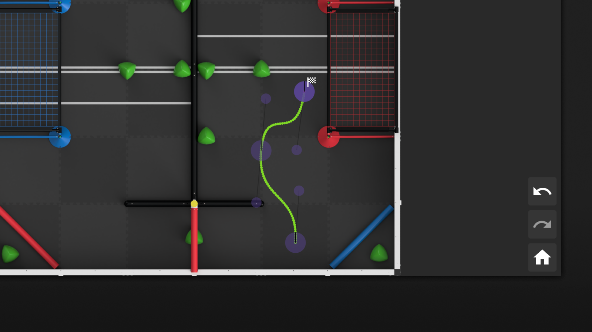

import ReactPlayer from 'react-player'

# Getting Started

Welcome to PATH.JERRYIO! This page will guide you through the basics of PATH.JERRYIO. If you are new to PATH.JERRYIO, this page is a great place to start.

After you enter the editor, the first thing you can see is the field. It is the latest VRC field in the current season.

## Create the First Path

To create the first path, you can left-click anywhere on the field. A control point with a little white flag will be created at the position you clicked. It is the destination of the path. The starting point of the path is at the center of the field.

As you can see, there are two types of purple circles on the field. The smaller one is a **normal control point**. The bigger one is an **end control point**, which also has a tiny black line pointing upward.

You can drag the purple circles to reshape the path and add more control points by left-clicking on the field. Deleting control points can be done by right-clicking on them.

If you want to add a straight line, you can right-click on the field. A straight line will be created at the end of the path. Note that a straight line only has 2 control points, while a curve has 4 control points.

## Understanding the Concept of Path

PATH.JERRYIO is using bézier spline to form a path. It consists of multiple segments, which are multiple bézier curves connected together, sharing endpoints.

Each bézier curve is either a cubic bézier curve or a simple bézier curve. A bézier curve is defined by its control points. A cubic bézier curve has 4 control points, which makes it a "curve". A simple bézier curve has only 2 control points, which makes it a "straight line".

All the control points(purple circle) can be called "Control", but the shared endpoints(big purple circle) of the segments are called "End Control" in order to distinguish them. Only end control points have heading attributes to indicate the target heading of the robot when the robot is at that point.

If you want to know more about bézier curve and spline, please check out these videos by Freya Holmér:
[The Beauty of Bézier Curves](https://youtu.be/aVwxzDHniEw) and [The Continuity of Splines](https://youtu.be/jvPPXbo87ds)

## Exploring the Field Canvas

First, you can try selecting multiple controls by dragging a rectangle with your mouse. You can also select multiple controls by holding shift and left-clicking on them. After selecting multiple controls, you can drag them to move them together.

<ReactPlayer playing loop controls url="/img/getting-started-select-multiple-controls.mp4" style={{margin: "20px 0", maxWidth: "100%"}} />

Next, you can try to hold the middle wheel button and drag it to the pan. If you are using a laptop with a touchpad, you can also use it to pan. To zoom in/out, you can hold ctrl and scroll the middle wheel.

<ReactPlayer playing loop controls url="/img/getting-started-moving-around.mp4" style={{margin: "20px 0", maxWidth: "100%"}} />

## A List of Common Operations

Try these operations to get familiar with the editor.

### Create

- Left-click on the field to create a curve at the end of the path
- Right-click on the field to create a line at the end of the path
- Right-click on the path to insert a control point in the middle of it

### Modify

- Left-click on a control point to select it
- Left click on a path segments(segment) to convert it into line or curve
- Drag a control point to shape the path
- To select multiple controls: 
  - Hold shift and left-click the controls; or
  - Drag a rectangle with/without holding the shift key; or
  - Select controls in the Path Panel on the left
- To drag multiple controls simultaneously: 
&nbsp;1. Select the controls 
&nbsp;2. Drag one of the selected controls 
- While dragging control(s), press shift to start magnetic mode
- Scroll the middle wheel on an end control to change the heading

### Delete

- Right-click on a control point to delete it
- Click the delete button in the Path Panel to delete controls or paths

### Undo/Redo

Undo/Redo any modification with Ctrl+Z/Ctrl+Y or select Undo/Redo in the edit menu.

## Exploring the User Interface

PATH.JERRYIO has a user interface and layout similar to many other path editors and path planning tools.

The editor is divided into three sections: the left section contains the application menu and path tree, the middle section contains the path editor, and the right section contains all the config panels. To learn more about the user interface, please check out the [User Interface](user-guides/user-interface) page.

If you are using PATH.JERRYIO to map out a path for your teammates and discuss it with them, you can ignore most of the panels. You can left-click the menu button on the top left corner of the editor, and select "View" -> "Exclusive Layout". The editor will switch to the exclusive layout, which maximizes the field canvas and hides all the panels.

## Save and Load

You can save your work by clicking the menu button on the top left corner of the editor and selecting "File" -> "Save". It will bring up a file explorer, allowing you to choose the location and name of the path file to save to. Once the file is saved, you can use "File" -> "Save" next time to save the path to the same file without bringing up the file explorer again.

:::info 

**Save As** and **Save** are not supported on Firefox. They are replaced by **Download As** and **Download**.

:::

Alternatively, you can click the menu button on the top left corner of the editor, and select "File" -> "Download As" / "Download". **Download** is different from **Save** as it creates a new file every time.

To open your saved path file, you can click the menu button on the top left corner of the editor, and select "File" -> "Open". It will bring up a file explorer, allowing you to choose the path file to open. Once the file is opened, you can use "File" -> "Save" next time to save the path to the same file without bringing up the file explorer again.

## Learn More About PATH.JERRYIO

If you want to learn more about PATH.JERRYIO, you can check out the [Concepts](user-guides/concepts) page to learn more about the concepts behind PATH.JERRYIO. You can also check out the [User Interface](user-guides/user-interface) page to learn more about the user interface of PATH.JERRYIO.

## Support

If you have any questions or suggestions, please join our [Discord Server](https://discord.gg/4uVSVXXBBa).
You can also report bugs or request features on the [GitHub Page](https://github.com/Jerrylum/path.jerryio) too.
