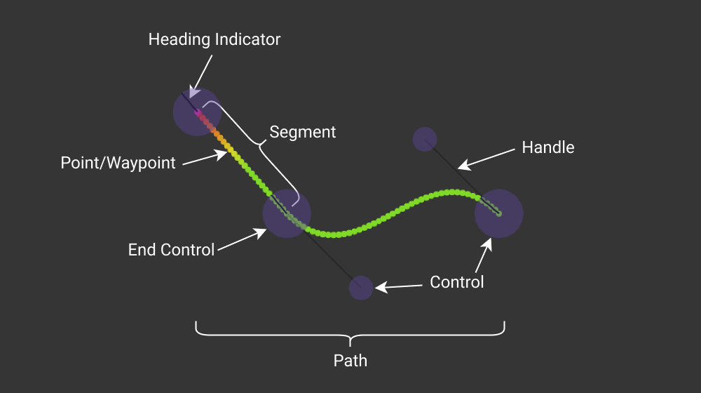

# Concepts

## Bézier Spline and Path

PATH.JERRYIO is using bézier spline to form a path. It consists of multiple segments, which are multiple bézier curves connected together, sharing endpoints.

In PATH.JERRYIO, each bézier curve is either a cubic bézier curve or a simple bézier curve. A bézier curve is defined by its control points. A cubic bézier curve has 4 control points, which makes it a "curve". A simple bézier curve has only 2 control points, which makes it a "straight line".

All the control points(purple circle) can be called "Control", but the shared endpoints(big purple circle) of the segments are called "End Control" in order to distinguish them. Only end control points have heading attributes to indicate the target heading of the robot when the robot is at that point.

In the above example, there is a path with 2 segments. The first segment is a cubic bézier curve, and the second segment is a simple bézier curve. There are 5 control points in total, and 3 end control points.

- **Path** - A path is a collection of segments. In PATH.JERRYIO, all paths are bézier splines.
- **Segment** - A segment is a bézier curve. It is defined by its control points. In PATH.JERRYIO, a segment can be a cubic bézier curve with 4 control points, or a simple bézier curve with 2 control points.
- **Control Point** - A control point is a point that defines a segment. It is a purple circle in the editor. A control point can be a shared endpoint of multiple segments (a.k.a End Control Point) or a non-shared point in a cubic bézier curve.
- **End Control Point** - An end control point is a control point that is a shared endpoint of multiple segments. It is a big purple circle in the editor. An end control point has a heading attribute to indicate the target heading of the robot when the robot is at that point.
- **Point/Waypoint** - After the path is generated, the path will be sampled into points and uniformly distributed along the path based on the point density setting. A point has the x and y coordinates, speed and optional properties, like heading.

If you want to know more about bézier curve and spline, please check out these videos by Freya Holmér:
[The Beauty of Bézier Curves](https://youtu.be/aVwxzDHniEw) and [The Continuity of Splines](https://youtu.be/jvPPXbo87ds)

## Field and Coordinate System

PATH.JERRYIO is using the same coordinate system as the VEX V5 GPS (Game Positioning System) Sensor. The field is a 2D plane, Y Axis increases by north, X Axis increases by east, heading in degree starting from north (Y+ Axis) and increasing clockwise. The origin is the center of the field, even if it is a VRC field or a VIQC field.

A VRC field is 12 feet by 12 feet and each tile is 2 feet by 2 feet. On the other hand, A VIQC field is 8 feet by 6 feet and each tile is 1 foot by 1 foot. The origin for both fields is the center of the field.

## Format

PATH.JERRYIO is a flexible multi-purpose path editor/planner. It can be used to generate path files in any format, not just a path file generator for a specific library.

In other words, it is a program that takes a list of paths as input and outputs a path file in a specific format. A path file can be a binary file or a text file which consists of the data for the robot to read and the data for the editor to read. 

1. **Data for the robot to read** - The data for the robot to read is the data that the robot needs to follow the path. It usually includes all the coordinates, headings, and speeds of the points along the path. LemLib v0.4 format can only include one path for the robot to read. However, it is technically possible to include multiple paths.
2. **Data for the editor to read** - The data in JSON format for the editor to read. This section should be ignored by the robot.

PATH.JERRYIO supports multiple formats by default. Developers can create their own format for PATH.JERRYIO to output. PATH.JERRYIO provides an easy-to-use API for developers to create their own format in TypeScript. 

## Bent Rate and Speed Calculation

A **Speed Keyframe** is a point in the speed graph defined by its x and y coordinates. The x coordinate is the position of the speed keyframe along the path. The y coordinate is the speed of the robot at that point. It is an orange circle in the speed graph.

**Bent rate** is 2-dimensional curvature measured in rad/mm. It is a non-negative real number. Curvature represents how bent the curve is at any given point. If the curve is a straight line, curvature is 0 and bent rate is 0. The larger the curvature, the more tightly bent the curve is.

:::info 

The definition of bent rate can be changed by the format. Please check the documentation for the format you are using.

:::

If the robot is going straight, it should be able to go at full speed. However, if the robot is making a turn, it has to slow down to make the turn. The tighter the turn, the slower the robot has to go. Bent rate is used to limit the target speed of the robot when the robot is making a turn.

**Minimum and maximum speed** are the minimum and maximum speeds of the robot. The limits are used to limit the result of the speed calculation. The maximum speed is used as the default target speed when there is no speed keyframe in the speed graph. The values are displayed on the left side of the speed graph.

**Bent Rate Applicable Range** is the window for which bent rate is used to limit the target speed. The starting and ending values are displayed on the right side of the speed graph.

:::info

The bent rate applicable range is configurable in the Path Config Accordion by default. However, it can be calculated automatically by the format. In that case, the slider for the bent rate applicable range is hidden. Please check the documentation for the format you are using.

:::

**Speed Calculation**

After a set of points along the path at a uniform distance is calculated, the speed of the robot at each point is calculated based on the speed keyframes and the bent rate applicable range.

First, a speed keyframe with the maximum speed is added at the beginning of the calculation. This is also why if there is no speed keyframe in the speed graph, the maximum speed will be used as the target speed for all points.

In Example 1, the maximum speed is 1 m/s while the minimum speed is 0.6 m/s. There are 2 speed keyframes in the speed graph.

Then, the speed of each point is calculated by linearly interpolating between the speed keyframes. For example, if one keyframe is at 0.5 m/s and the other keyframe is at 0.8 m/s, the speed of all points between these 2 keyframes will be interpolated between 0.5 m/s and 0.8 m/s.

The "Bent Rate Interruption" flag can be set to true for any speed keyframe. A keyframe with the flag set to true is a grey circle in the speed graph, while a normal keyframe is an orange circle. 

A keyframe with the "Bent Rate Interruption" flag set to true affects the speed calculation of the points between the keyframe and the next keyframe:

- If the bent rate of the path at a point is within the bent rate applicable range, then the output speed at the point will be determined to bent rate. (see Example 3)
- If the bent rate is greater than the max bent rate, then the minimum speed will be used.
- If the bent rate is less than the minimum bent rate, then the maximum speed will be used.
- If the speed determined by linear interpolation is less than the results from the above equation (but no less than the minimum speed), then that will be used for the output speed instead. (see Example 2)

The formula can be simplified to:

