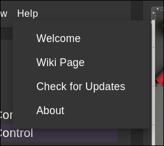
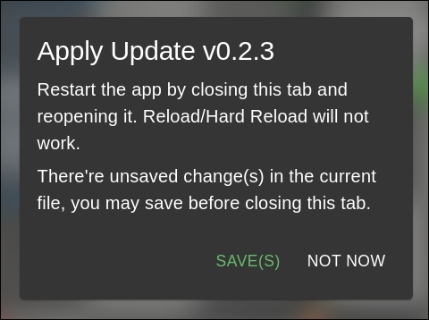

# Update the Editor

PATH.JERRYIO is a Progressive Web Apps (PWA) that is installable and can be used without an internet connection. Unlike a normal website which can be updated by simply refreshing the page, PATH.JERRYIO is an offline-first app which means it has to be updated manually.

## Update Notification

When there is a new version available, a notification will be shown on the top left corner of the screen.

## Checking for Updates

You can also check for updates manually by clicking on the "Check for Updates" button in the "Help" menu.

## Steps to Update

In order to update PATH.JERRYIO, you need to close all the tabs that are currently opening PATH.JERRYIO. After that, you can reopen PATH.JERRYIO and it will be updated to the latest version.

If you have multiple tabs open, you will be required to close all of them before the update is applied.

