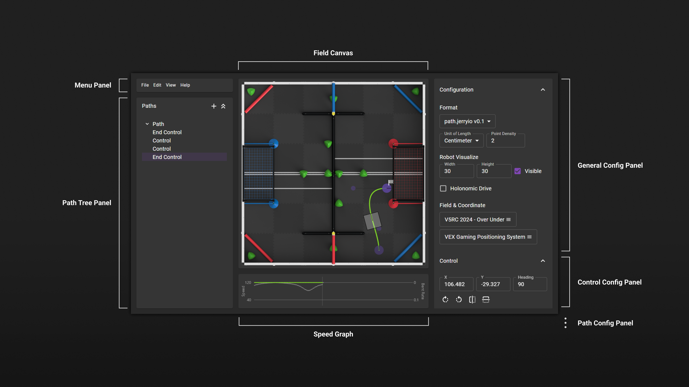
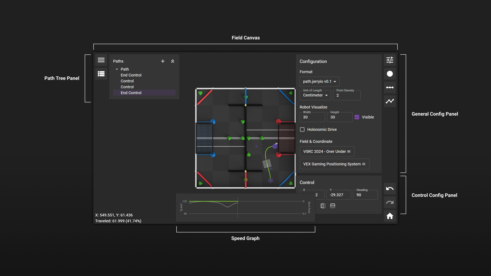
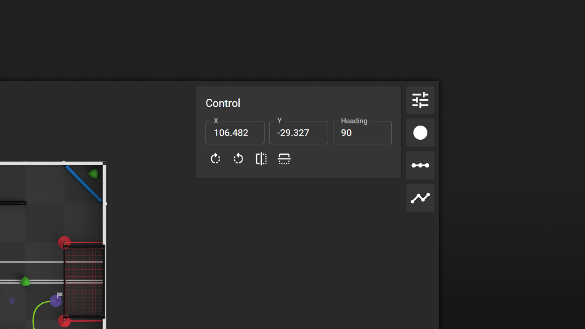

import ReactPlayer from 'react-player'

# User Interface

PATH.JERRYIO has a user interface and layout similar to many other path editors and path planning tools. The editor is divided into three sections: the left section contains the application menu and path tree, the middle section contains the path editor, and the right section contains all the config panels.

## Panels

PATH.JERRYIO comes with a simple and intuitive user interface. The user interface is divided into three sections and each section contains one or more panels. A panel is a container for displaying editor and configuration information. Sometimes, a panel can be expanded or collapsed by clicking on the panel header:

- **Field Canvas** - The main canvas for drawing the paths.
- **General Config Accordion** - The panel for general configurations, for example, which format to use, unit of length, point density, etc.
- **Path Config Accordion** - The panel for path configurations, for example, minimum and maximum speed, etc.
- **Menu Accordion** - The panel for menu items.
- **Path Tree** - A hierarchical representation of the paths and controls in the editor. The path tree can be used to select and edit paths and controls.
- **Speed Graph** - A graphical representation of the speed profile of the selected path. The speed graph can be used to edit the speed profile by adding speed keyframes on the graph.

## Layouts

PATH.JERRYIO has multiple layouts that can be selected from the application menu, including the classic layout, the exclusive layout, and the mobile layout. Not all the layouts are available on all window sizes. The most suitable layout will be selected automatically based on the window size of the browser.

The classic layout is the default layout. The exclusive layout is a layout that is designed for users who have a large screen. The exclusive layout is similar to the classic layout, but it has a larger path editor, and all other panels are hidden by default. The mobile layout is a layout that is designed for mobile devices.

In the exclusive layout, all panels are hidden by default and can be opened by clicking on the panel icons from the left or right sidebar. All the panels are floating on top of the path editor and listed on the left side or right side, similar to the classic layout.

Although the mobile layout is designed for mobile devices, all the layouts support touch screens and trackpads.

## General Config Accordion

The General Config Accordion contains all the general configurations for the editor, including all the default settings and additional settings from the format you are using:

- **Format** - The format of the path file. The format can be changed at any time, and the editor can automatically convert the path file to the new format.
- **Unit of Length** - The unit of length used in the editor. All the input fields and information related to coordinates and distances are presented in this unit. The default unit of length is based on the format you are using. For example, the path.jerryio format uses centimeters by default, and the LemLib format uses inches. The unit of length can be changed at any time, and the editor can update all the input fields to adapt to the new unit of length. However, it doesn't affect how the output path file is generated.
- **Point Density** - The spacing between two waypoints on the path. The point density is based on the unit of length setting. For example, if the unit of length is set to centimeter, then a value of 2 means 2 centimeters. It is a [computable input field](#computable-input-field).
- **Robot Size** - The size of the robot visualized in the editor and based on the unit of length setting. The input fields are [computable input fields](#computable-input-field).
- **Robot Visible** - Whether the robot is visible in the editor. After setting this to true, the robot will be visible in the editor when hovering the mouse over the selected path, which allows you to see the robot's position and orientation along the path.
- **Holonomic Drive** - Whether the robot is holonomic. If the robot is holonomic, it can move in any direction without changing its orientation. If the robot is not holonomic, it can only move in the direction it is facing. This is used for robot visualization in the editor only. When this is set to true, the heading of the robot will be referenced to the heading attribute of the end controls in the current segment. <ReactPlayer playing loop controls url="/img/user-interface-holonomic-drive-differents.mp4" style={{margin: "20px 0", maxWidth: "100%"}} />
- **Field Layer** - The field image used in the editor. It can be customized by uploading a new image. See more details in the [Asset Manager](#asset-manager) section.

## Control Accordion

The Control Accordion allows you to inspect and enter the x and y coordinates of the control points. It is only available when exactly one control point is selected. When multiple control points are selected, the input fields are disabled.

In addition, when an end control point is selected, the heading of the end control point can be edited. The heading is the direction in degree.

All input fields in the control accordion are [computable input fields](#computable-input-field). The units are based on the unit of length setting.

## Path Config Accordion

The Path Config Accordion contains all the path configurations, including the minimum and maximum speed, the bent rate applicable range, and additional settings from the format you are using. To learn more about the speed and bent rate, please check out the [Concepts > Bent Rate and Speed Calculation](./Concepts#bent-rate-and-speed-calculation) section.

## Menu

The menu provides access to all the features of the editor. It is divided into four sections: File, Edit, View, and Help.

### Open

**Open** opens an existing path file on your computer. After opening the path file, you can use **Save** next time to save the path to the same file.

### Save / Save As

**Save As** brings up a file explorer, allowing you to choose the location and name of the path file to save to. Once the file is saved using **Save As**, you can use **Save** next time to save the path to the same file without bringing up the file explorer again.

:::info 

**Save As** and **Save** are not supported on Firefox. They are replaced by **Download As** and **Download**.

:::

### Download / Download As

**Download As** downloads the path file to your computer and prompts you to choose the name of the file every time. **Download** downloads the path file and only prompts you to choose the name of the file the first time. **Download** is different from **Save** as it creates a new file every time.

## Path Tree Accordion

The Path Tree Accordion is a hierarchical representation of the paths and controls in the editor. The path tree can be used to select and edit paths and controls. A path file can contain multiple paths and all paths in the file are listed in the path tree.

- **Add New Path** - Adds a new path to the path file.
- **Collapse All / Expand All** - Collapses or expands all the paths in the path tree.

In the above example, Path 1 has three segments, and Path 2 has one segment.

For Path 1, the first segment has two end controls and two controls. The second segment has two end controls. The third segment has two end controls and two controls. In total, there are eight items in Path 1. They are all listed in the path tree from starting point to destination, top to bottom.

When you hover to an item in the path tree, the following options will be displayed:

- **Edit Path Name (Pencil)** - Edits the name of the path.
- **Delete Path (Trash Can)** - Deletes the path.
- **Lock Path (Lock)** - Locks the path. When a path is locked, all its end controls and controls are locked. Locked controls cannot be selected. This is useful when you want to prevent accidental changes to the path.
- **Show Path (Eye)** - Shows or hides the path in the editor. When a path is hidden, it is not visible in the editor, but it is still visible in the path tree. This is useful when you want to hide a path temporarily.

Not all types of controls have the same options. For example, controls can not be deleted.

Paths and end controls are draggable. You can drag them to reorder them in the path tree. When you drag a path, all its end controls and controls will be dragged together.

After you drag an end control from one location to another location, the editor will automatically reevaluate the structure of the path and update the path accordingly. Only segments with two items or four items are valid. If the path is invalid, the editor will try to fix the path by removing control points.

## Speed Graph

The Speed Graph is a graphical representation of the speed profile of the selected path. The speed graph can be used to edit the speed profile by adding speed keyframes on the graph. It is a dual-axis graph with the x-axis representing the position of the speed keyframe along the path and the y-axis representing the speed of the robot at that point.

On the left side, the y-axis represents the speed of the robot in the units of length per second. On the right side, the y-axis represents the best rate of the robot in rad/mm.

Each segment is separated by a vertical line.

You can add a new speed keyframe by clicking on the speed graph. A **Speed Keyframe** is an orange circle in the speed graph. It is a grey circle when the "Bent Rate Interruption" flag is set to true. You can drag the speed keyframe to change its position and left-click to toggle the "Bent Rate Interruption" flag. To delete a speed keyframe, you can right-click on the speed keyframe.

All waypoints along the path are displayed as colored dots in the speed graph. The color of the dot represents the speed of the robot at that point from red to green, where red is the minimum speed and green is the maximum speed. The longer the path, the more waypoints there are. You can scroll the speed graph to see more waypoints using mouse wheel or trackpad.

A **Bent Rate Result** is a grey dot in the speed graph. The bent rate is used to limit the target speed of the robot when the robot is making a turn. To learn more about the speed and bent rate, please check out the [Concepts > Bent Rate and Speed Calculation](./Concepts#bent-rate-and-speed-calculation) section.

## Computable Input Field

A computable input field is an input field that supports basic math operations and units. It is commonly used in the editor for inputting the point density, robot size, coordinates, and more.

It is very important to understand how the computable input field works: After you press enter, the input field will try to parse the input as a math expression. If the input is a valid math expression, the input field will evaluate the expression and display the result. Otherwise, the input field will display the input as it is.

For example, if the unit of length is set to centimeters and a control point is selected, the x coordinate input field will display the x coordinate of the control point in centimeters. Then:
- If you enter a value of `2` into the input field, the x coordinate of the control point will be updated to `2` centimeter.
- If you enter a value of `2in` into the input field, the x coordinate of the control point will be updated to `5.08` centimeter.
- If you enter a value of `2+3in` into the input field, the x coordinate of the control point will be updated to `7.08` centimeter. In this example, `2` doesn't have a unit, so it defaults to centimeters. `3in` has a unit of inch, so it is converted to centimeters.

The following operations are supported:

| Operation      | Symbol |
| -------------- | ------ |
| Addition       | +      |
| Subtraction    | -      |
| Multiplication | \*     |
| Division       | /      |

The following units are supported:

| Unit        | Symbol |
| ----------- | ------ |
| Millimeters | mm     |
| Centimeters | cm     |
| Meters      | m      |
| Inches      | in     |
| Feet        | ft     |
| Tiles       | t      |

Furthermore, brackets are also supported. For example, `2 * (3+4)` is a valid input. The spacing between the numbers and the operators is optional. For example, `2*(3+4)` is also a valid input.

A computable input field also supports using the `up` or `down` arrow keys to increase or decrease the value by 1. The increment or decrement amount is based on the unit of length setting.

## Asset Manager

Assert Manager is a modal that allows you to manage all the assets used in the editor, such as field images. 

### Field Images

PATH.JERRYIO has support for setting custom field backgrounds with custom sizes. This allows the software to be used with other fields from other robotics competitions, like FRC or FTC.

To change the field image, click on the field layer drop-down list in the General Config Accordion and select the field you want to use. If you want to use your own field image, select the "custom" option.

This will bring up the Asset Manager. Click on the "Create" button under the "Field Image" section to add a new field image.

PATH.JERRYIO uses the real-world dimensions of your image in order to preserve the distance between points. As you switch between images, PATH.JERRYIO automatically adjusts the position of your points based on the dimensions of each image.

- **Name** - The name of the field image. It can be changed after the field image is created.
- **Height in Millimeters** - The height of the field image in millimeters in the real world. The width of the field image will be calculated automatically based on the aspect ratio of the image.
- **Source** - The source of the field image. It can be a URL or a file on your computer. 
  - If you are using a URL, enter the URL to the "Image URL" input field. You need to make sure the URL is accessible by the editor. If you want to share the path file with other people or open the path file on another computer, the URL must be accessible by other people or other computers.
  - If you are using a file, upload the file to the "File Upload" input field. PATH.JERRYIO will store the file in your browser. If you want to share the path file with other people or open the path file on another computer, you need to upload the file again on the other computer.

PATH.JERRYIO will remember if a path file was created on a custom field. If you save a path file using a custom field and open it on another computer, The following dialog will be displayed:

For security reasons, PATH.JERRYIO will not automatically download the field image from the URL. You need to click on the "Yes" button to download the field image. If you don't want to download the field image, you can click on the "No" button to use the default field image.

If the path file uses a custom field image and the field image is missing from the local storage, you need to upload and install the image file or click "No" to use the default field image. Although the path file doesn't contain the field image, it contains the field image's signature to verify its integrity. You need to upload the field image with the same signature to install the field image.
